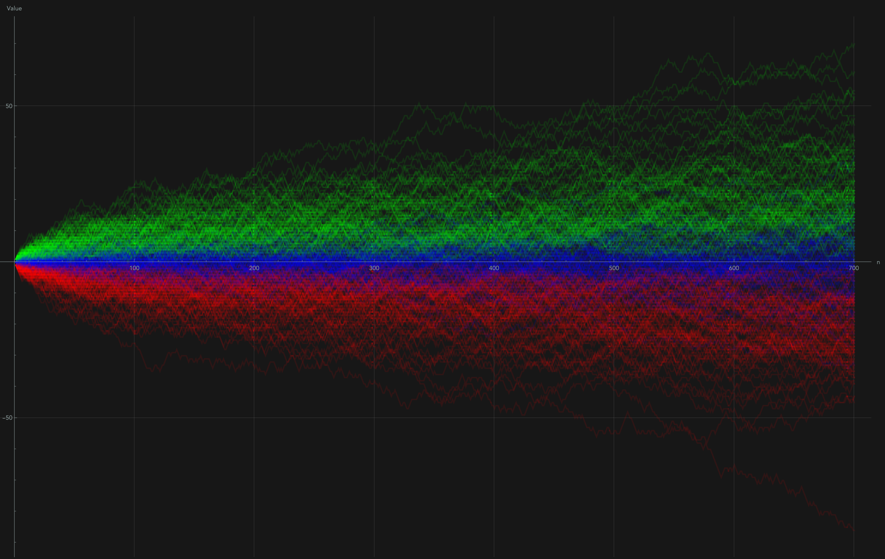
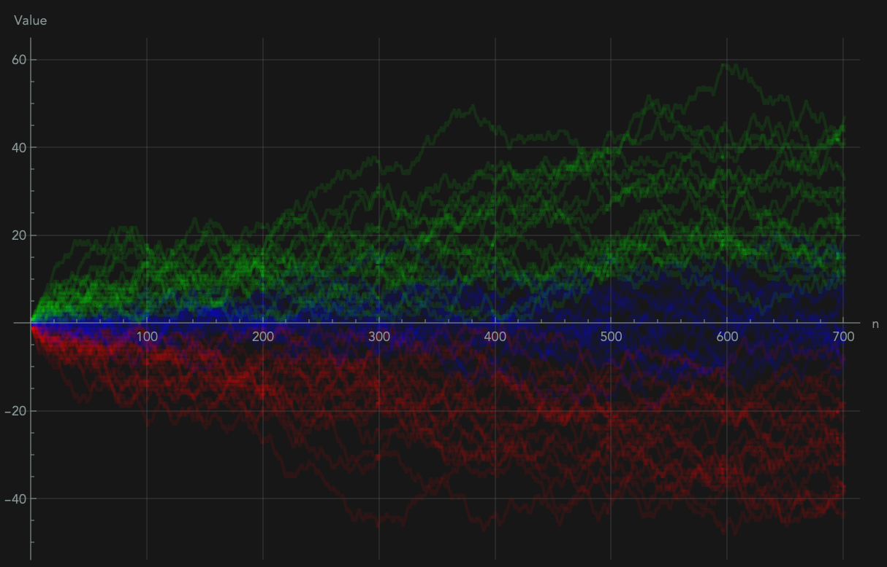
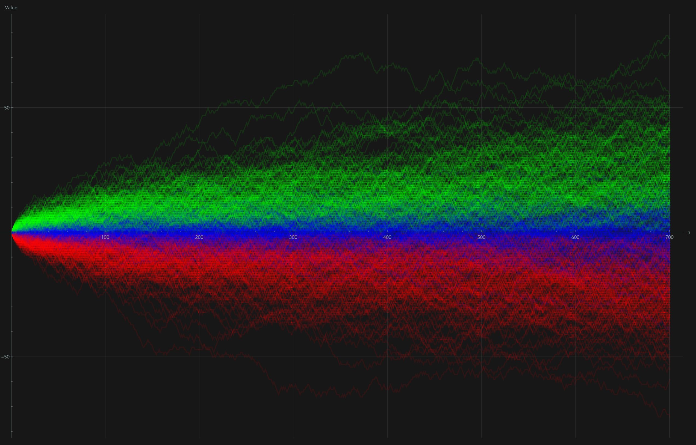

# Random Vectors for Putnam 1995 A6

Visuals from a simple experiment inspired by Problem A–6 of the 1995 William Lowell Putnam Mathematical Competition. The code generates many independent columns of random permutations of $\{1,2,3\}$, accumulates the three row sums across columns, and overlays the resulting trajectories.

## 100 Independent Vector Paths Plotted

## Problem background (informal)

> Each of $n$ columns independently contains a random permutation of $1,2,3$. Let the three row sums of the resulting $3\times n$ matrix be $a,b,c$, sorted so that $a\le b\le c$. Show that for some $n\ge 1995$, it is at least four times as likely that $b=a+1$ and $c=a+2$ as it is that $a=b=c$.

This is the official A–6 statement from 1995, rephrased for readability. For the original wording, see the 1995 Putnam write‑up in *American Mathematical Monthly* and common archives of past Putnam problems.  

**Idea.** Subtract 2 from each entry so every column becomes a permutation of $(-1,0,1)$. As you add columns, the centered row‑sum vector performs a random walk on the plane $x+y+z=0$ (a triangular lattice). The event $a=b=c=2n$ is “endpoint at the origin,” while $\{a,b,c\}=\{2n-1,2n,2n+1\}$ is “endpoint is any permutation of $(-1,0,1)$.”

## What the plots show

Each image overlays many independent runs of the three cumulative row sums vs. the column index (so there are three semi‑transparent lines per run). The thicker bands around the line $2i$ reflect the variance growth of a mean‑zero step $\in\{-1,0,1\}$.

### Above

- **100-lines.png:** 100 independent vector runs, modest spread.

### Below 

- **20-lines.png:** 20 runs, clearer banding and concentration near the mean.
- **200-lines.png:** 200 runs, a denser picture of the typical fluctuations.

These pictures are purely illustrative: they show the random‑walk structure behind A–6 and why, for sufficiently large $n$, being at a nearest neighbor of the origin is collectively more likely than being exactly at the origin.

## Reproducing the figures

- The Mathematica notebook `random-variable-code.nb` contains the code that generates:
  - the cumulative row‑sum trajectories for many runs, and
  - quick frequency summaries of the final row sums.
- Change the parameters near the bottom of the notebook:
  - `GenerateStackedPlots[numPlots, n]` where `numPlots` is how many independent runs you want to overlay, and `n` is the number of columns (steps) per run.
  - The last line `Show[lineplots, PlotRange -> All]` renders the stacked trajectories. Export with `Export["<name>.png", %]`.

## References

- Official 1995 write‑up: *The Fifty‑Sixth William Lowell Putnam Mathematical Competition*, **American Mathematical Monthly** (1996). PDF via University of Hawai‘i archive: https://math.hawaii.edu/home/pdf/putnam/1995.pdf
- A concise solution outline: John Scholes’s Kalva archive entry for 1995 A–6: https://prase.cz/kalva/putnam/psoln/psol956.html

*This repository exists to visualize the stochastic process behind the problem, not to provide an official solution.*

---

## More Plots

### 20 Vector Paths

### 200 Vector Paths

